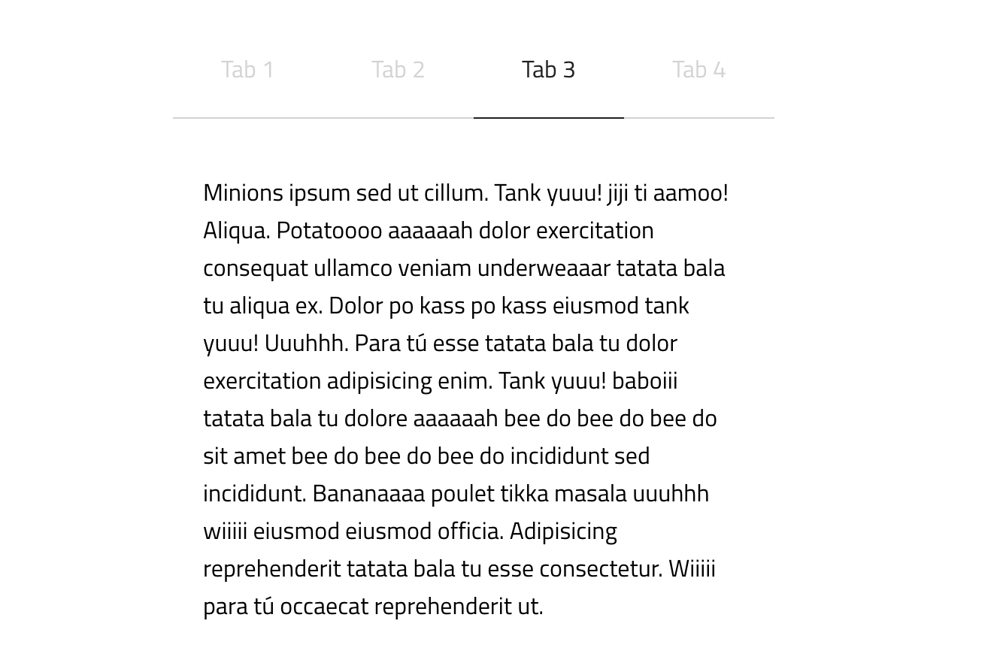

# Tabby

Lightweight and simple Vanilla JS Tab Switcher Plugin

<p align="center"></p>

<p align="center">
    
    
</p>

---


## Install

### npm

``` npm
$ npm i tabsjs-lib
```

``` javascript

const Tabby = require('tabsjs-lib');
Tabby.init();

```

### script

Install tabby is quit simple. Create the simple markup and include the script. Then you are ready to go!

### Markup

Tabby works with data attributes, so we need to use three different data attributes here.

attribute | description
----------|-----------
data-tabby | the container wraps your tabs
data-tabby-bar | bar that needs a value which links to the content
data-tabby-content | content part that needs a value which links to the bar


Here is a very simple markup

<sub>The bar and content elements needs to be siblings</sub>

``` html
<div data-tabby>

    <div class="bars">
        <div data-tabby-bar="1">Bar one</div>
        <div data-tabby-bar="2">Another bar</div>
    </div>

    <div class="content">
        <div data-tabby-content="1">Content one</div>
        <div data-tabby-content="2">Content two</div>
    </div>

</div>

<script src="<path_to_file>/tabby.iife.js"></script>
<script>
    Tabby.init();
</script>

```

## Tabby

#### Tabby.init **function**
This method will initialize the tab components in the dom and will create an instance of the tabby class
for each `[data-tabby]` element. It will return the objects in an array.

#### Tabby.Tabby **class**
This is our base class `Tabby`. Here you can create the instance by yourself.

#### Tabby.version **string**
Return the currenty used version number

## Methods

When you have created a few instances you can use some methods on them.

``` javascript
  // myTaby is an array which contains the objects
  const myTabs = Tabby.init();

  // lets just pick the first one
  const myFirstTab = myTabs[0];

  // now we can use the methods on them
```

#### Methods next()
Switches to the next element.

``` javascript
myFirstTab.next();
```

#### Methods previous()
Switches to the previous element.

``` javascript
myFirstTab.previous();
```

## <a href="https://janmarkuslanger.github.io/tabby/">Demo</a>

## Questions
For questions and support will free to create an issue or write an email to
janmarkuslanger10121994@gmail.com

## Issues
If you found a bug then please create an issue. It will help a lot.

## Contribution
Pull requests are always welcome. I am always happy to see others working on
my GitHub projects.

## Get in touch
Write an email to janmarkuslanger10121994@gmail.com :)

